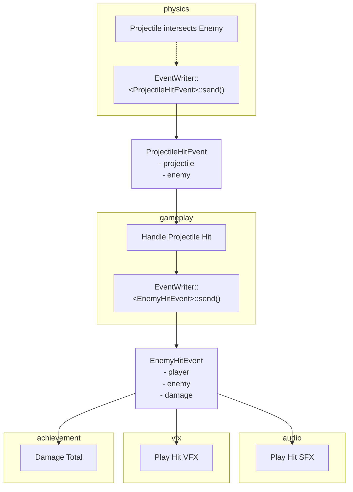

# Bevy Best Practices

An opionated set of convensions I stick to in my [Bevy](https://bevyengine.org/) projects.

Up to date as of Bevy 0.11.

## Table of Contents
- [Entities](#entities)
  - [Name and Cleanup](#name-and-cleanup)
- [System Schenduling](#system-scheduling)
  - [Update systems should be bounded](#update-systems-should-be-bounded)
  - [Co-locate system registration for the same `State`](#co-locate-system-registration-for-the-same-state)
- [Events](#events)
  - [Prefer Events for structuring logic and systems](#prefer-events-for-structuring-logic-and-systems)
  - [Explicit ordering](#explicit-ordering)
  - [Explicit event handling system run criteria](#explicit-event-handling-system-run-criteria)
- [Helpers](#helpers)
  - [Cleanup](#cleanup)
  - [Getter Macros](#getter-macros)
- [Project Structuring](#project-structuring)
  - [Prelude](#prelude)
  - [Plugins](#plugins)

## Entities

### Name and Cleanup

All entities must be spawned with a `Name` and cleanup component at the front of the bundle.

Names assist with debugging. Cleanup components indicate to which state the entity belongs, and to remove it upon exit of that state.

By always having these two "meta" components at the front it makes it easy to spot entities where they are missing.

```rust
commands
    .spawn((
        Name::new("Player"),
        cleanup::CleanupInGamePlayingExit,
        ...
    ))
```

You can read more about the cleanup pattern I'm using in the [bevy cheatbook](https://bevy-cheatbook.github.io/patterns/generic-systems.html).

## System Scheduling

### Update systems should be bounded

All systems added to the `Update` schedule should be bound by run conditions on `State` and `SystemSet`.

Run states enables easy enabling/disbling of groups of behaviour & reduces systems running when they don't need to.

For example, changing `PlayingState` to `PlayingState::Paused` will automatically disable all systems that progress the game and enable systems handle actions related to the pause menu.

System sets force coarse grained ordering leading to predictable behaviour between different parts of the game.

_There can be exceptions to this, for example you may have background music or UI animations that should continue in both `Playing` and `Paused`._

```rust
.add_systems(
    Update,
    (handle_player_input, camera_view_update)
        .chain()
        .run_if(in_state(PlayingState::Playing))
        .run_if(in_state(GameState::InGame))
        .in_set(UpdateSet::Player),
)
```

### Co-locate system registration for the same `State`

State transitions should have `setup` and `cleanup` specific systems. Their `OnEnter` and `OnExit` registration should be co-located.

This means it's easy to see the setup systems and that it has a cleanup system to run.

```rust
.add_systems(OnEnter(GameState::MainMenu), main_menu_setup)
.add_systems(OnExit(GameState::MainMenu), cleanup_system::<CleanupMenuClose>)
.add_systems(Update, (...).run_if(in_state(GameState::MainMenu)))
```

## Events

### Prefer Events for structuring logic and systems

Use [Events](https://docs.rs/bevy/latest/bevy/ecs/event/index.html) to structure logic and communication between subsystems of your game.

Events allow different parts of your game to opt-in to information they need, and prevents tight coupling.

`EventWriters` and `EventReaders` are implemented as a [thin layer](https://docs.rs/bevy_ecs/0.11.0/src/bevy_ecs/event.rs.html#558-569) over a vanilla `Vec` so they're cheap to use, and subsequent `send`s will re-use the allocated capacity. Systems that read from the same event can also run in parallel as `EventReader`s are local to the system.

Here's an example of one way you might structure a projectile hitting an enemy, all the way to audio, visual effects, and achievements being updated. You should evaluate the use of events on a case by case basis, as they're not free, and for simple local operations it can be enough to mutate within the same system.



### Explicit ordering

Event readers should be ordered after their respective writers within the frame.
Undefined ordering between writers and readers can lead to subtle out of order bugs.
Delaying communication across frames is often not intentionally desired. If it is something you want it should be made explicit.

There are exceptions for systems like achievements or analytics, but I'd only recommend excluding them from ordering if you have a good reason. Often they will not be computationally intense, so having them all run at the end of frame is fine.

You can achieve this by using `event_producer.before(event_consumer)` or `(event_producer, event_consumer).chain()` when adding systems for systems within the same `SystemSet`. For events that cross a `SystemSet` boundary this should be taken care of by the ordering of the `SystemSet`s in your `app.configure_sets()` call.

### Explicit event handling system run criteria

Systems that only do work based on an event should have that as part of their run condition.

```rust
fn handle_player_level_up_event(mut events: EventReader<PlayerLevelUpEvent>) {
    events.iter().for_each(|e| {
        // ...
    });
}

handle_player_level_up_event.run_if(on_event::<PlayerLevelUpEvent>())
```

## Helpers

Write helper utilities for common operations

### Cleanup

Tag entities with a cleanup [Zero Sized Type (ZST)](https://doc.rust-lang.org/nomicon/exotic-sizes.html#zero-sized-types-zsts) component. We can then add our cleanup utility system with our new cleanup component as the type. This creates a simple and consistent way to remove all entities marked with the component when transitioning or exiting certain states.

```rust
#[derive(Component)]
struct CleanupInGamePlayingExit;

fn cleanup_system<T: Component>(mut commands: Commands, q: Query<Entity, With<T>>) {
    q.for_each(|e| {
        commands.entity(e).despawn_recursive();
    });
}

// When spawning entities
commands.spawn((
    Name::new("projectile"),
    CleanupInGamePlayingExit,
    ...
));

// Add to state transition
.add_systems(
    OnExit(GameState::InGame),
    cleanup_system::<CleanupInGamePlayingExit>,
)
```

Credit to [bevy cheatbook](https://bevy-cheatbook.github.io/patterns/generic-systems.html).

### Getter Macros

When working with queries and the `Entity` type, often you'll be matching on the outcome to exit early if the entity was not found.

The tedium of writing match expressions all over the place to return early can be avoided through a few simple macros. I've provided a one but you can imagine more variations based on the methods on `Query`.

Do be careful when using these, as opposed to the panicing methods like `query.single()`, these will silently return. This may be appropriate for your game, however it could also lead to bugs and unusual behaviour if they were supposed to succeed.

You could even make variations of these that return in release but panic in debug if that fits your use case.

```rust
fn print_window_size(windows: Query<&Window>) {
    let window = get_single!(windows);
    println!("Window Size: {}", window.resolution);
}

#[macro_export]
macro_rules! get_single {
    ($q:expr) => {
        match $q.get_single() {
            Ok(m) => m,
            _ => return,
        }
    };
}
```

## Project Structuring

### Prelude

Bevy utlises a prelude module to great effect for easy access to common imports. We can do the same!

By creating a prelude module in our project and exporting the various types that are commonly used within our game we can greatly cut down on the number of imports we need to maintain. You can also bring in the preludes from commonly used dependencies if you like. I have done that here with bevy and rand.

A nice side effect of this pattern is moving around code or refactoring doesn't require changes in as many places. If you restructure your audio code, you only need to update how it's presented in the prelude, assuming the rest of your project utilises the prelude.

`src/audio.rs`
```rust
pub(crate) mod prelude {
  pub(crate) use super::{EventPlaySFX, SFXKind};
}

#[derive(Event)]
pub(crate) struct EventPlaySFX { /* ... */ }
pub(crate) enum SFXKind { /* ... */ }
```

`src/prelude.rs`
```rust
pub(crate) use bevy::prelude::*;
pub(crate) use rand::prelude::*;

// Common items available at the root of the prelude
pub(crate) use crate::{Enemy, Health};

// Specific areas nested within their own module for self documenting use
pub(crate) mod audio {
    pub(crate) use crate::audio::prelude::*;
}

pub(crate) mod physics { /* ... */ }
```

`src/enemy.rs`
```rust
use crate::prelude::*;

fn handle_enemy_health_changed(
    mut commands: Commands,
    enemies: Query<(&Health, Entity), (With<Enemy>, Changed<Health>)>,
    mut play_sfx: EventWriter<audio::EventPlaySFX>,
) {
    enemies.for_each(|(health, id)| {
        if health.current <= 0. {
            commands.entity(id).despawn_recursive();
            play_sfx.send(audio::EventPlaySFX::new(audio::SFXKind::EnemyDeath));
        }
    });
}
```

### Plugins

Bevy [Plugins](https://docs.rs/bevy/latest/bevy/app/trait.Plugin.html) enable grouping systems, components, and resources into logical units. They're used heavily in Bevy itself and are what powers the ability to [turn on/off parts of the engine](https://docs.rs/bevy_internal/0.11.0/src/bevy_internal/default_plugins.rs.html#38).

By constructing your game out of plugins you make it easier to find, work with, and debug subsystems. It also contextualises the setup and configuration of 3rd party crates to where they belong. For example, setting up the resources, plugins, and systems to utilise a 3rd party terrain library would go in your `TerrainPlugin`. That way, disabling your own terrain plugin will also disable the library you've imported, and any other resources that only it needed.

> **Note**
> 
> Your mileage may vary with "enabling"/"disabling" plugins in your game. Bevy implements it in engine because it's valuable to disable chunks of the engine. However to achieve this in the game itself is not only more difficult, but the payoff is lower. How often will you realistically want to remove physics or audio from your game?


`src/audio.rs`
```rust
pub(crate) struct AudioPlugin;
impl Plugin for AudioPlugin {
    fn build(&self, app: &mut App) {
        app.add_plugins(some_audio_library::AudioFXPlugin)
            .init_resource::<MyAudioSettings>()
            .add_systems(...);
    }
}
```

`src/physics.rs`
```rust
pub(crate) struct PhysicsPlugin;
impl Plugin for PhysicsPlugin {
    fn build(&self, app: &mut App) {
        app.add_plugins(some_physics_library::BouncyPhysicsPlugin)
            .init_resource::<MyPhisicsSettings>()
            .add_systems(...);
    }
}
```

`src/game.rs`
```rust
pub(crate) struct GamePlugin;
impl Plugin for GamePlugin {
    fn build(&self, app: &mut App) {
        app.add_plugins((
          DefaultPlugins,
          crate::AudioPlugin,
          crate::PhysicsPlugin,
        ));
    }
}
```

`src/main.rs`
```rust
fn main() {
    bevy::prelude::App::new()
        .add_plugins(crate::game::GamePlugin)
        .run();
}
```

## License

Except where noted, all code in this repository is dual-licensed under either:

* MIT License ([LICENSE-MIT](LICENSE-MIT) or [http://opensource.org/licenses/MIT](http://opensource.org/licenses/MIT))
* Apache License, Version 2.0 ([LICENSE-APACHE](LICENSE-APACHE) or [http://www.apache.org/licenses/LICENSE-2.0](http://www.apache.org/licenses/LICENSE-2.0))

at your option.
This means you can select the license you prefer!
This dual-licensing approach is the de-facto standard in the Rust ecosystem and there are [very good reasons](https://github.com/bevyengine/bevy/issues/2373) to include both.

### Your contributions

Unless you explicitly state otherwise, any contribution intentionally submitted for inclusion in the work by you, as defined in the Apache-2.0 license, shall be dual licensed as above, without any additional terms or conditions.